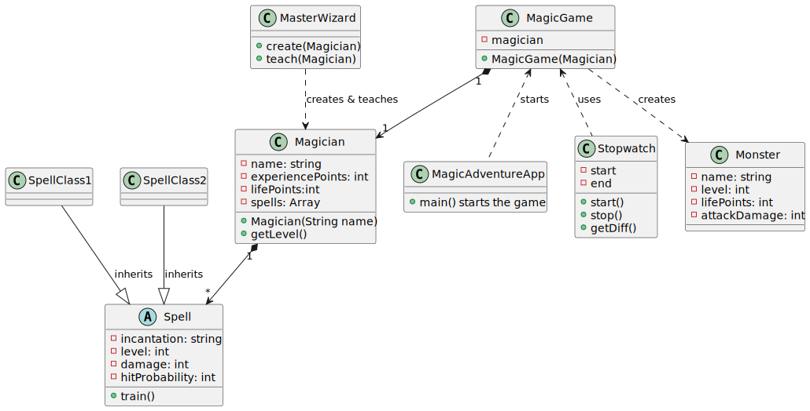

:toc:
:toclevels: 6
:toc-title: Übersicht
:description: Programmierprojekt SoSe 2023 Grundlagen der Programmierung Deadline 11.7.2023 23:59
:tip-caption:  pass:[&#128681;]

= Aufgabenstellung Magic Adventure

Im Rahmen des Programmierprojekts soll Ihr ein Konsolenspiel gemäß der folgenden Beschreibung entwickeln:

== 1. Beschreibung

Du lebst den Traum von soooo vielen!
Du kannst zaubern!
Nun, noch nicht ganz und Du hast noch viel zu lernen, um ein*e Großmeister*in zu werden.
Und das sollte möglichst schnell geschehen, denn magische Monster sind Dir schon auf den Fersen.

Zum Beginn Deiner Reise begegnest Du einem alten weisen Speller, der Dein Talent erkennt und Dir anbietet, Dir Deinen ersten Spell zu lehren.
Mit diesem Spell gerüstet kannst Du in den Kampf ziehen.
Besiege so viele Monster wie möglich, um Erfahrungspunkte zu erhalten und Level aufzusteigen.
Mit jedem neuen Level kannst Du zu dem alten Weisen zurückkehren und er ist bereit, Dir weitere Spells zu unterrichten.

Jeder einzelne Spell ist gegen einen anderen Typen von Monstern effektiv _(Zusatzaufgabe)_.
Wie können jedoch Monster besiegt werden, deren Typ sich als besonders resistent gegen Deine Spells erweist?
Nun, nur weil Du einen Spell erlernt hast, heißt das ja natürlich nicht, dass Du ihn schon perfekt beherrschst!
Auch Deine Spells können durch Übung verbessert werden aber das heißt üben üben üben.
Um besser zu werden, muss eine Aufgabe erfüllt werden. _(mehr dazu <<Spell,hier>>)_

Wenn Du alle Spells gemeistert hast, dann hast Du das Ziel, ein Großmeister zu werden, wahrlich erreicht!

=== Hinweise für folgende Aufgaben

. Ihr könnt in den geforderten Klassen weitere Attribute und Methoden (neben den definierten) hinzufügen.
. Die Aufzählung der anzulegenden Klassen ist nicht erschöpfend, das heißt, dass Ihr weitere Klassen (wie Ihr diese benötigt) für Euer Projekt anlegen könnt.
. Testet Euren Code schrittweise.
Nehmt Euch es sich zum Ziel, immer ausführbaren Code zu haben.
Setzt einen Schritt nach dem anderen um, nicht alles auf einmal.
. Bei der Aufgabenstellung handelt es sich um ein Konsolenspiel.
Stellt sicher, dass die Aussagen auf der Konsole für Euch und auch mögliche andere Spieler*innen aussagekräftig sind und anzeigen was passiert.
. Seid kreativ!
Ihr sollt die geforderte Funktionalität umsetzen; wie Ihr diese jedoch ausschmückt und im Detail gestaltet, ist Euch überlassen.
. Ihr könnt jederzeit Zwischen-Commits machen.
Hierbei ist es ratsam, immer ein Präfix mit der Aufgabe, an der Ihr grade arbeitet, der Commitmessage hinzuzufügen.
Bsp: `git commit -m "Abgabe1 - Authortag wurde hinzugefügt"` Die jeweiligen Abgabe-Commits mit dem entsprechenden Kommentar sind jedoch verpflichtend.
Der damit verbundene Commit-Timestamp gilt als Abgabezeitpunkt!
Solltet Ihr Verbesserungen an Eurem Code vornehmen und diesen noch innerhalb der Zeit einreichen wollen, so könnt Ihr dies tun, indem Ihr den Abgabe-Commit erneut verwendet.
Es wird immer der letzte Commit gewertet.
. Es ist Euch immer gestattet, Klassen mit notwendigen Gettern und Settern auszustatten.
Achtet jedoch darauf, wie diese verwendet werden und haltet generell Attribute eher _private_.
. Es ist empfehlenswert auf Englisch zu programmieren.
. Der gesamte Code kann durch den Einsatz von Packages übersichtlicher gestaltet werden.
. Bitte denkt stets an Lesbarkeit und Einrückung! (strg+alt+l -> Intellij) (strg+shift+i -> VSCode)
. Alle von Euch implementierten Klassen und public Methoden sollen mit einem geeigneten JavaDoc dokumentiert werden.

=== Hinweis zu Git

Die Bearbeitung und auch ein Großteil der Abgaben des Projekts geschieht über das Versionierungstool git.
Bitte installiere dieses Tool auf Deinem PC. 
Du kannst hierfür link:https://git-scm.com/book/en/v2/Getting-Started-Installing-Git[die Anleitung auf der offiziellen git-Seite] benutzen.

== 2. Vorbereitung _(Abgabedatum: 25.06.2023 23:59)_

Erstellt Euch einen link:https://github.com/signup[github-Account].
Dieser wird gebraucht, da der Projekt-Starter-Code auf github ist und Ihr Euren Code während des Projekts regelmäßig auf github hochladen werdet.
Ihr könnt einen beliebigen Anzeigenamen wählen.
Wichtig ist es jedoch, dass  Ihr Eueren vollständigen Namen in den Konfigurationen von git hinterlegt, damit wir zuordnen können, von wem die Commits kommen.
Dies geschieht nach der Installation über folgende Befehle auf der Commandline

[source,bash]
----
git config --global user.name "Dein Vor- und Nachname"
git config --global user.email "Deine E-mail"
git config --list
----

Mit dem letzten Befehl kann überprüft werden, ob Deine Einstellungen richtig gesetzt wurden.
In der auftauchenden Liste sollten diese Einträge auftauchen:

* user.email=<Deine E-mail>
* user.name=<Dein Vor- und Nachname>

Einigt Euch, wer von Eurem Zweierteam ein Repository anlegt.
Die Person geht dann in moodle auf den Classroom-Link eurer Dozentin oder eures Dozenten und erstellt ein Repository.
Folgt hierzu der Beschreibung aus der Vorlesung.
Die zweite Person vom Team soll sich während der Übung von dem*r Dozent*in als Kollaborateur*in eintragen lassen.
Checkt dann den Startcode des Projekts aus und fügt ihn in Visual Studio Code / Intellij oder einer anderen IDE Eurer Wahl hinzu.

Damit Ihr sicherstellt, dass der Setup funktioniert und für die einfache Zuordnung Eures Codes zu beiden Teammitgliedern, fügt der Klasse MagicAdventureApp Javadoc hinzu mit der Annotation `@author` und schreibt Eure vollständigen Namen dahinter.
Anschließend soll diese Änderung als 1. Commit zum Repository hinzufügt werden.
Führt Euren ersten Commit mit der Commitmessage -> `Abgabe 1` durch.

Stöbert in dem bisher vorhanden Code herum und macht Euch damit vertraut.
Führt den Code aus und erstellt Euch einen Plan, wie Ihr das Projekt aufbauen möchtet _(Siehe <<Aufgabe3>>)_

Die Methoden _hasRunningGame(), deleteGame(), loadGame(), saveGame(), hasSavedGame()_ sind bereits implementiert und müssen nicht weiter angepasst werden und können für die weiteren Aufgaben verwendet werden.

=== Abgabe

Pusht Euer Zwischenergebnis unter dem Abgabe-Commit `Abgabe 1`

[#Aufgabe3]
== 3. Entwurf des Spielablaufs _(Abgabedatum: 28.06.2023 23:59)_

Erstellt einen ersten Entwurf Eures Spiels.
Beginnt vom Hauptmenü aus.
Definiert, welche Eingaben der Spieler*in zulässig sind und zu welchen anderen Konsolendialogen diese verzweigen.

TIP: Denkt an Euren klickbaren Prototypen aus GSE.

Definiert, welche Benutzer*in-Eingaben grundsätzlich möglich, aber nicht zulässig sind.
Legt fest, was in einem solchen Fall passieren soll.
Der Entwurf soll alle Teile des Spiels visualisieren.
Der Entwurf dient als Grundlage Eurer Programmentwicklung.
Er soll Euch helfen, das Spiel zu skizzieren, ohne dass Ihr es direkt in Programmcode umsetzen müsst.
Der Entwurf macht 3 der 40 Punkte des Projekts aus.

Für ein vollständiges Verständnis des Spiels empfiehlt es sich, dieses Dokument vollständig zu lesen!

Legt Eure Ausarbeitungen in Eurem Projekt im Wurzelverzeichnis unter dem Namen *_Spielskizze_*.<Dateiformat> ab und pusht diesen mit dem Abgabe-Commit `Abgabe 2`.
Solltet Ihr Eure Ausarbeitungen auf Papier durchgeführt haben, so fotografiert diese ab.
Bitte achtet dabei darauf, dass Eure Ausarbeitungen leserlich sind!

=== Abgabe

Pusht Euer Zwischenergebnis unter dem Abgabe-Commit `Abgabe 2`

== 4. Hauptmenü _(Abgabedatum: 01.07.2023 23:59)_

Implementiert ein Benutzermenü, das auf der Konsole angezeigt wird.
Folgende Optionen soll der*ie Spieler*in haben:

. `Start new game`: Neues Spiel starten
. `Resume game`: Spiel fortsetzen _(Nur anzeigen, falls ein Spiel läuft)_
. `Load game`: Spiel laden _(Nur Anzeigen, wenn gespeichertes Spiel vorhanden)_
. `Save game`: Spiel speichern _(Nur anzeigen, falls ein Spiel läuft)_
. `Delete game`: Spiel löschen _(Nur anzeigen, falls ein Spiel vorhanden)_
. `Quit`: Programm beenden

Nutzt dafür die vorgegebene Klasse `MagicAdventureApp` und erweitert diese.
Nehmt den Spieler*in-Input entgegen und ruft die ausgewählte Methode auf.
Nutzt dazu die fertigen Methoden _startNewGame, loadGame, saveGame, hasSavedGame, deleteGame() und hasRunningGame_.
Denkt daran, fehlerhafte Eingaben zu behandeln.
Umschließt das Hauptmenü mit einer Schleife, sodass das Programm nach jeder aufgeführten Methode ins Hauptmenü zurückkehrt, bis der*ie Spieler*in das Programm durch Eingabe beendet.

=== Abgabe

Pusht Euer Zwischenergebnis unter dem Abgabe-Commit `Abgabe 3`

== 5. Vorbereitung des Abenteuers _(Abgabedatum: 06.07.2023)_

=== Neue Klassen

Um ein Abenteuer zu starten, müssen vorher folgenden Klassen angelegt und partiell implementiert werden:

* Eine Magician-Klasse
* Eine Spell-Klasse
* Eine MasterWizard-Klasse
* Eine Monster-Klasse

==== Magician Klasse

TIP: Die Klasse Magician existiert bereits.
Bitte lasst den Klassen-Kopf und das Attribut serialVersionUID wie es ist.
Solltet Ihr es verändern, ist ein Speichern des Spiels durch die bereits implementierte Funktionalität nicht mehr sichergestellt.

Ein Magician hat folgende Attribute:

* `name`: einen Namen
* `spells`: eine Sammlung von beherrschten Spells (max 5)
* `experiencePoints`: zu Beginn 0 Erfahrungspunkte
* `lifePoints`: 1000 initialen Lebenspunkte

Erstellt einen Konstruktor, der den Namen entgegennimmt und die anderen Werte setzt.
Der*ie Magician besitzt eine Methode, die _getLevel()_ heißt.
Diese gibt das Level des Magicians wieder und berechnet sich wie folgt:

 Wurzel(Erfahrungspunkte) = Level

[#Spell]
==== Spell Klasse

TIP: Die Klasse Spell existiert bereits.
Bitte lasst den Klassen-Kopf und das Attribut serialVersionUID wie es ist.
Solltet Ihr es verändern, ist ein Speichern des Spiels durch die bereits implementierte Funktionalität nicht mehr sichergestellt.

Ein Spell sollte als Überklasse zu anderen spezifischen Spells dienen. _(Spezifische Spells werden später implementiert)_.
Ein Spell hat folgende Attribute:

* `incantation`: Einen Satz, den man _aufsagen_ muss, um ihn zu verbessern
* `damage`: Ein Wert, der bestimmt wie viel Schaden der Spell verursacht
* `hitProbability`: Ein Wert zwischen 1 und 100, der bestimmt wie wahrscheinlich der Spell gelingt
* `level`: Ein Wert, der das Level des Spells angibt.

[#Aufgabe]
Ein Spell sollte außerdem die Methode _train()_ haben, die einen Spell verbessert.
Damit dieser jedoch verbessert wird, müsst Ihr den Spell aufsagen und das in einer Zeit, die mit aufsteigender Stufe immer geringer wird.
Die Zeit berechnet sich wie folgt:

 (Länge der Spell-Incantation in Zeichen) / (aktuelle Stufe des Spells + 1) * 1000 = Millisekunden die benötigt werden dürfen

Der*ie Spieler*in soll den Spell sehen, dann mit Eingabe bestätigen, dass er*sie bereit ist und die Eingabe des Spelles wiederum mit _enter_ bestätigen.

Zum Messen der Zeit könnt Ihr die bereits implementierte Klasse _StopWatch_ verwenden.

==== MasterWizardKlasse

Erstellt eine Klasse für den MasterWizard, der Euch die Spells beibringen kann.
Da dieser sehr alt ist, ist er entsprechend nicht mehr so gelenkig und kann daher nur aus `static` Methoden bestehen.
Er sollte mindestens folgende Funktionalität haben:

* Einen Magician erstellen und zurückgeben
* Einem Magician einen Spell beibringen _(nimmt Magician als Input)_

==== Monster Klasse

Ein Monster hat folgende Attribute:

* `name`: einen Namen
* `level`: Level
* `lifePoints`: Lebenspunkte
* `attackDamage`: Angriffspunkte

Je nach Level entscheidet sich wie viel Angriffs- und Lebenspunkte das Monster hat.

Lebenspunkte berechnen sich wie folgt:

 Level * 100 = Lebenspunkte

Angriffspunkte berechnen sich wie folgt:

 Level * 50 = Angriffspunkte

=== MagicGame erweitern

Die Klasse MagicGame soll nun einen Konstruktor erhalten, der die Variable `player` setzt.

=== Abgabe

Pusht Euer Zwischenergebnis unter dem Abgabe-Commit `Abgabe 4`

== 6. Das Spiel mit Leben füllen _(Abgabedatum: 10.07.2023 23:59)_

TIP: Sobald das Spiel neu gestartet wird, müsst Ihr eine Möglichkeit finden, dass der*ie Magician bereits einen Spell besitzt.

=== Weitere Spells

Denkt Euch beliebig viele Spells (mindestens 5) aus.
Für jeden Spell soll eine eigene Klasse angelegt werden.
Dies dient der Übersichtlichkeit und der späteren Möglichkeit die Klassen zu erweitern _(Zusatzaufgabe)_.
Alle Spells sollten von der Spell-Klasse erben, sodass während der Laufzeit kein Object der Klasse Spell instanziiert wird, sondern lediglich Unterklassen verwendet werden.

=== Game Menü

Das Game-Menü besteht aus folgenden Optionen:

. `Start adventure`: Auf Reisen gehen
. `Learn new spell`: Neuen Spell lernen
. `Improve spell`: Spell verbessern
. `Show stats`: Aktuelle Werte anzeigen lassen
. `Take a rest`: Pause machen
. `Back to main menu`: Hauptmenü

Dieses Menü soll angezeigt werden, sobald ein Spiel gestartet oder fortgesetzt wird.

==== Auf Reisen gehen

Auf Reisen begegnet man Monstern.
Das Level der Monster ist minimal eins tiefer und maximal eins höher als das des Magicians.
Anschließend beginnt ein Kampf, indem zuerst der*ie Magician einen seiner*ihrer Spells auswählt, mit dem er*sie dem Monster Schaden zufügt.
Sollte das Monster überlebt haben, so fügt es seinerseits dem*er Magician Schaden zu.

Sollten die Lebenspunkte des*er Magicians unter 0 sinken, so ist das Spiel verloren und kann nicht weitergespielt werden.

Wenn der*ie Magician gewinnt, steigen die Erfahrungspunkte um die Anzahl des Levels des Monsters.

==== Neuen Spell lernen

Der*ie Magician geht zum MasterWizard.
Dieser überprüft, ob der*ie Magician ein höheres Level als Anzahl bereits bekannter Spellsprüche hat.
Wenn dies zutrifft, dann darf der*ie Magician sich einen noch nicht erlernten Spell aus.

==== Spell verbessern

Der*ie Magician kann einen Spell wählen, den er*sie verbessern möchte.
Hierzu muss die Methode <<Aufgabe,train()>> verwenden werden.
Sollte ihm*ihr dies gelingen, steigt das Level des Spells.
Sollte er*sie scheitern, so kann er*sie keinen Spell mehr verbessern, bis er*sie erneut auf Abenteuer gegangen ist.

==== Aktuelle Werte anzeigen lassen

Schreibt eine Ausgabe des*er Magicians, die den Namen, die aktuellen Lebenspunkte, das Level und die vorhandenen Spells mit ihrem jeweiligen Level und Grundwerten auf der Konsole ausgibt.
Verwendet hierbei das Überschreiben der Standardmethode `toString()` eines jeden Objektes.

==== Pause machen

Bei einer Pause sinken die Erfahrungspunkte um 1 und die Lebenspunkte steigen um 100. Eine Pause kann beliebig oft durchgeführt werden, bis der Erfahrungspunktestand des*er Magicians auf 0 gesunken ist.

==== Hauptmenü

Bringt einen zurück ins Hauptmenü.
Das Spiel kann dort gespeichert, neu gestartet, geladen (damit wird das aktuelle Spiel durch das geladene überschrieben), fortgesetzt oder beendet werden.

=== Spiel gewonnen

Das Spiel ist sofort gewonnen, wenn der*ie Magician das Level 5 erreicht hat.

=== Abgabe

Pusht Euer Zwischenergebnis unter dem Abgabe-Commit `Abgabe 5`

[#Klassendiagramm]
== 7. Klassendiagram

Unterstützen kann Euch bei Eurer Implementierung auch dieses Klassendiagram.
Bitte bedenkt, dass dieses Diagram keinerlei Anspruch auf Vollständigkeit hat und nur eine Hilfe sein soll.
Es muss nicht 1:1 so implementiert werden.

== 8. Zusatzaufgaben

Zusätzliche Erweiterungen sind denkbar.
Für jeweils 2 Extrapunkte könnt Ihr:

. Einen Typ für Spell und Monster implementieren und in jeweiliger Abhängigkeit des Typs des Spells zu dem Typen des Monsters mehr oder weniger Schaden verursachen.
. Mindestens 2 weitere kleine "Minispiele" erfinden, die für einen Spell gewonnen werden müssen, um ihn zu verbessern.
. Eine Typunterscheidung der Monster vornehmen, nach der jeder Typ jeweils unterschiedlich viel Leben, Attackschaden und eine Trefferwahrscheinlichkeit hat.

